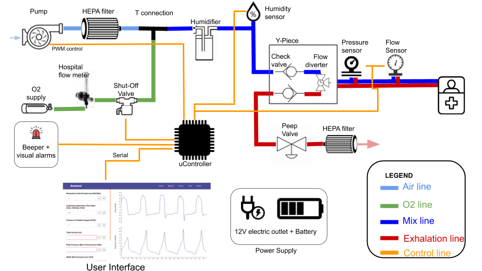

# Anemoi : Open Source Ventilator

In the context of the COVID-19 pandemic, the global health system is facing a ventilator shortage. This initiative aims at providing a low-cost and open-source hardware & software design made from ubiquitous components. 

# Bill of Materials

1. Access to 3d printer and PLA filament. (Our prototype was printed on the Monoprice 3D printer V2)

2. 5/8 inch vinyl tubing (15mm interior diameter)

3. Brass connectors & valves

4. Microcontroller (i.e. arduino) and Computer (i.e. Raspberry Pi)

5. Barometric Pressure (BM280) and Differential (MXP5010) Pressure Sensors

6. Air Pump >50 Watts

7. 12V car battery

# CADs

## Turbine Pump Design

Link to calculator,

		https://inventory.powerzone.com/resources/centrifugal-pump-power-calculator/

## Venturi Valve

The tidal volume delivered to the patient is an essential measurement and thus requires a flow meter. This component is placed in series with the patient's air flow. 
We went with a design with no moving parts that leverages the Venturi effect. The air flows through a constricted section of a pipe. In the direction of the flow, a pressure reading is taken before entering the choke and in the choke. The flow rate can then be obtained with this equation,

Our venturi valve is bidirectional to measure the expiratory and inspiratory flow. STL can be found in anemoi/cad/venturi/. 

# Sensors

Sampling frequency for all sensors should be >100ms to prevent performance drops on the UI.

## Pressure Calibration

We connected the water column and the sensor in parallel and we applied a constant pressure using a balloon that we inflate or deflate. 

We read the values coming from the sensor using the test_sensor.py script. Here are our results,

		Measure Pressure   |   Actual Pressure (cmH2O)
					-4.74   |   0
					15.21   |   20
					17.11   |   22
					18.94   |   24
					20.8   |   26
					22.88   |   28
					24.57   |   30
					26.11   |   32
					27.15   |   34
					26.47   |   36
					27.45   |   38
					7.39   |   11
					6.25   |   10
					5.12   |   9
					4.3   |   8
					0.88   |   4
					2.88   |   6
					-1.22   |   2
					-0.14   |   3
					1.84   |   5
					8.81   |   12
					13.65   |   17
					12.83   |   16
					12.12   |   15
					16.77   |   19

We find the linear regression to find the calibration coffeciants (true_val = c1*sensor_val + static diff between sensors), 

		c1 = 1.14
		c2 = Measured when the machine boots up

## Flow Calibration

For the flow we use Archimede's Principle stating that if a body is completely submerged the volume of fluid displaced is equal to the volume of the body. We fill a inverted graduated cylinder with water and we place it into a water bucket. We insert the 5/8 tube at the very top of the cylindar (to prevent bubble creation pressure transients).
We integrate the flow sensor reading with the sampling time to get the volume measured and we compare it to the actual volume. The equation relating the flow to the pressure in a venturi valve is squared root. 

Here are our results,

		Displaced Volume (mL)  |  Square Root of Flow Sensor Rieman Sum
		-------------------------------------------------------------------------------------
						600   |   1.67
						600   |   1.63
						1000   |   2.26
						700   |   1.53
						1000   |   2.26
						900   |   2.32
						650   |   1.53
						1750   |   2.64
						1500   |   3.1
						1200   |   2.31
						1750   |   2.51
						700   |   1.83
						1700   |   2.62
						1500   |   2.36
						1800   |   3.31
						450   |   1.12
						1450   |   2.93
						600   |   1.26
						1000   |   2.28
						450   |   1.16
						700   |   1.64
						650   |   1.61
						650   |   1.22
						650   |   1.4
						600   |   1.2
						1000   |   1.55
						800   |   1.52

We force the y intercept to be at 0,

# Arduino 

## Mise-en-place

1. Install the following librairies and all dependencies

		Sparkfun BME280 Library

2. Upload the anemoi/arduino/arduino.ino script

# Raspberry Pi

## Installing Raspbian

Format SD Card,

1. Open Gparted

2. Select the SD Card drive

3. Delete all partitions

4. Right click and select format fat32

5. Run all operations

To upload image to SD card,

1. Download the latest Raspbian OS (https://www.raspberrypi.org/downloads/raspbian/)

2. Make sure the sha256 matches the name of the file :

		sha256sum filename.zip

3. Unzip the img

4. We write down the name of the sd card by running,

		sudo fdisk -l

5. We unmount the sd card by running :

		sudo umount /dev/sdb1

6. We write the img to the sd card :

		sudo dd bs=4M if=image_name.img of=/dev/sdb conv=fsync

7. Wait for transfer to end

8. Open /boot/ directory

9. Add file named 'ssh' (no extension)

10. Add file named wpa_supplicant.conf

		country=CA # Your 2-digit country code
		ctrl_interface=DIR=/var/run/wpa_supplicant GROUP=netdev
		network={
			ssid="WIFI_NAME"
			psk="WIFI_PASSWORD"
			key_mgmt=WPA-PSK
		}

11. Eject and Put the SD card in the Pi

12. Wait for Pi to boot and ssh using

		ssh pi@'ip'

		password : raspberry

## Secure the SSH

In order to ssh without a password, only the ssh-key

1. On the pi, generate new ssh keys pair (press enter for all questions) : ssh-keygen

2. Copy your computer's public id to the .ssh/authorized_keys file of the pi
	
		nano ~/.ssh/authorized_keys

## LAMP Stack

To deliver the Anemoi web app, you will need to setup your pi as a LAMP server

  * Make sure your pi is up-to-date

		sudo apt-get update
		sudo apt-get upgrade
		sudo apt-get autoremove

  * A web server
	
		sudo apt-get install apache2 -y

  * A database server
	
		sudo apt-get install mariadb-server -y

  * PHP
		
		sudo apt-get install php-fpm php-mysql -y

## The Firewall

1. Make sure your hostname is set correctly,

		hostnamectl set-hostname --YOUR HOSTNAME--

2. Also add it to hosts file by sudo nano /etc/hosts and adding this under 127.0.0.1 ...
	
		--IP-- --YOUR HOSTNAME--

1. Install ufw

		sudo apt-get install ufw

2. Setup the firewall

		sudo ufw default allow outgoing
		sudo ufw default deny incoming
		sudo ufw allow ssh
		sudo ufw allow 80
		sudo ufw allow 443
		sudo ufw enable
		sudo ufw status

## Mise-en-place

To setup Anemoi you need a couple of additional packages & configurations:

  * All the necessary packages
	
		sudo apt-get install git python3-dev pip3 python3-smbus i2c-tools

	
  * A lib manager

		sudo apt-get install python3-pip

  * The Python/MySQL connector
		
		sudo python3 -m pip install mysql-connector-python

  * The tmux program to launch multiple command line processes simultaneously
	
		sudo apt-get install tmux

  
  * Apache Php Interpreter
		
		sudo apt-get install php libapache2-mod-php

  * Make sure the I2C & Serial interface is enabled 

		https://learn.adafruit.com/adafruits-raspberry-pi-lesson-4-gpio-setup/configuring-i2c

	
  * In raspi-config and the timezone is the one you are in

  * Reboot
  

## Creating the database

1. Secure MySQL by running

		sudo mysql_secure_installation

1. Log into the MySQL database server

		sudo mysql

	
2. Create the DB that will be used by anemoi

		CREATE DATABASE anemoi;

3. Create a new user,

		CREATE USER 'username'@'localhost' IDENTIFIED BY 'password';

		GRANT ALL PRIVILEGES ON anemoi.* TO 'username'@'localhost' WITH GRANT OPTION;

		FLUSH PRIVILEGES;

4. Exit and Login with your new credentials

		exit
		mysql -u username -p

5. Select your database

		use anemoi;

6. Create the following tables,	

        CREATE TABLE patient (id int not null auto_increment, name VARCHAR(128), weight_kg int, age int, updated_at TIMESTAMP NOT NULL DEFAULT NOW() ON UPDATE NOW(), created_at TIMESTAMP NOT NULL DEFAULT NOW(), PRIMARY KEY (id));

        CREATE TABLE session (id int not null auto_increment, patient_id int, vac_pc tinyint(1) not null, vac_vc tinyint(1) not null, cpap tinyint(1) not null, bipap tinyint(1) not null, peep int not null, delta_p int, respiration_rate int, inspiration_expiration_ratio float, fio2 int, trigger_level float, tidal_volume int, max_pressure int, updated_at TIMESTAMP NOT NULL DEFAULT NOW() ON UPDATE NOW(), created_at TIMESTAMP NOT NULL DEFAULT NOW(), PRIMARY KEY (id));        

        CREATE TABLE pressure (id int not null auto_increment, value float not null, created_at TIMESTAMP(3) NOT NULL DEFAULT NOW(3), PRIMARY KEY (id));
        
		CREATE TABLE volume (id int not null auto_increment, value float not null, created_at TIMESTAMP(3) NOT NULL DEFAULT NOW(3), PRIMARY KEY (id));

		CREATE TABLE flow (id int not null auto_increment, value float not null, created_at TIMESTAMP(3) NOT NULL DEFAULT NOW(3), PRIMARY KEY (id));

7. Edit config file to start mysql with event_scheduler,

		sudo nano /etc/mysql/mariadb.conf.d/50-server.cnf

8. Add at bottom

		event_scheduler=ON

9. Turn on global scheduler,

		SET GLOBAL event_scheduler = ON;

10. Add pressure cleanup event,

		DELIMITER $$

		CREATE EVENT `Every_60_Minutes_Pressure_Cleanup` 
		ON SCHEDULE EVERY 10 MINUTE 
		ON COMPLETION PRESERVE 
		DO BEGIN delete from pressure where TIMESTAMPDIFF(MINUTE, created_at, now())>60; 
		END;
		$$
		DELIMITER ;

8. Add volume cleanup event,

		DELIMITER $$

		CREATE EVENT `Every_60_Minutes_Volume_Cleanup` 
		ON SCHEDULE EVERY 10 MINUTE 
		ON COMPLETION PRESERVE 
		DO BEGIN delete from volume where TIMESTAMPDIFF(MINUTE, created_at, now())>60; 
		END;
		$$
		DELIMITER ;

9. Make sure the events are saved,

		show events;

10. Check if the event scheduler is on,

		show variables where variable_name='event_scheduler';

## Managing your web folder

1. Change the permissions

		sudo chown -R pi:www-data /var/www/html/

		sudo chmod -R 770 /var/www/html/

## The Anemoi Source Code

1. Clone the Anemoi Repo in /home/

		git clone https://github.com/jeanromainroy/anemoi.git

2. Copy the web files inside your Apache folder

		cp -r ~/anemoi/rpi/web/* /var/www/html/

3. Sensor Packages
		
		sudo pip3 install pyserial bmp280

4. Set your DB credentials in,

		anemoi/rpi/local/db_helper.py

		anemoi/rpi/web/api/config/database.php

## Launching a Daemon on startup

1. Create a new service

        sudo nano /lib/systemd/system/anemoi.service

2. Paste in

        [Unit]
        Description=Anemoi Daemon
		After=mariadb.service

        [Service]
        Type=forking
        User=pi
        ExecStart=/usr/bin/tmux new-session -s anemoi -d 'python3 /home/pi/anemoi/rpi/local/run.py'
        ExecStop=/usr/bin/tmux kill-session -t anemoi
        WorkingDirectory=/home/pi/anemoi/rpi/local/

        [Install]
        WantedBy=multi-user.target

3. Add service

        sudo systemctl enable anemoi.service

4. Reload

        sudo systemctl daemon-reload

5. Restart it,

        sudo systemctl restart anemoi.service

6. Check the status

        systemctl status anemoi.service

## Useful commands

1. Check connected I2C addr

		sudo i2cdetect -y 1

2. Check serial devices

		dmesg | grep tty

3. To share your mouse/keyboard with the pi

  * Install on both machine

		sudo apt-get install x2x

  * Configure the SSH on the server

		nano /etc/ssh/sshd_config

		X11Forwarding yes

  * SSH using,

		ssh -X pi@192.168.XXX.XXX 'x2x -east -to :0'

